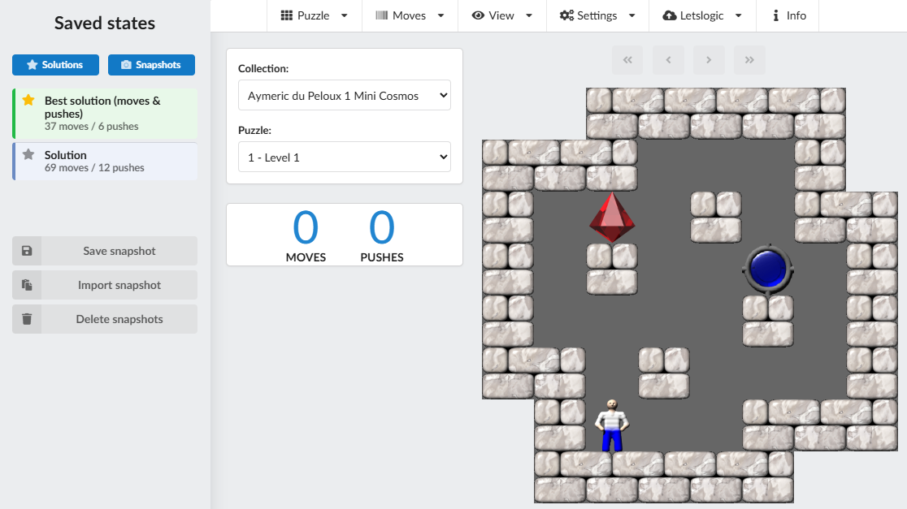

# SokobanScript – Sokoban in TypeScript

This is an implementation of the Sokoban game in TypeScript.

It has been implemented to offer a way to play the Sokoban puzzles which are part of the Sokoban solver tests published at:  
https://sokoban-solver-statistics.sourceforge.io/statistics/OpenTestSuite/

You can try out the app at:  
https://sokoban-solver-statistics.sourceforge.io/

Screenshot of the app:  


---

## Features

- Play Sokoban collections from various authors (du Peloux, GRIGoRusha, etc.)
- Multiple graphical skins and configurable tile sizes
- Keyboard and mouse control:
    - Keyboard: arrow keys or `WASD` / `IJKL`
    - Mouse: click on free cells or boxes to move / push
- Move and push counters
- Snapshots and solutions sidebar (saved states)
- Local storage of solutions in the browser
- Optional submission of best solutions to [Letslogic](https://www.letslogic.com/)

---

## How to Run the App Locally

### Step 1: Set Up Your Environment

1. **Download the project**  
   You can either:
    - Clone the repository:
      ```bash
      git clone https://github.com/Megerian/SokobanScript.git
      ```
    - Or [download the project as a ZIP file](https://github.com/Megerian/SokobanScript/archive/refs/heads/master.zip) and extract it.

2. **Install Node.js**  
   If you don’t have Node.js installed, download it from  
   https://nodejs.org/  
   Make sure to install the latest **LTS/stable** version.

---

### Step 2: Install Required Dependencies

1. **Navigate to the project folder**
   ```bash
   cd SokobanScript
   ```

2. **Install project dependencies**
   ```bash
   npm install
   ```

   This installs all required libraries and tools (including the local Parcel bundler).

---

### Step 3: Run the App in Development Mode

1. **Start the development server**
   ```bash
   npm run start
   ```

2. **Open the app in your browser**  
   Once the server starts, you should see something like:
   ```bash
   Server running at http://localhost:1234
   ```
   Open this URL in your browser to access the app.

---

## Building for Production

To build an optimized production bundle, run:

```bash
npm run build
```

This will create a production build in the `release/` directory:

```text
release/
 ├─ index.html
 ├─ styles.css
 ├─ <bundled JavaScript>
 └─ resources/
```

You can upload the **contents of `release/`** to any static web hosting (e.g. SourceForge, GitHub Pages, …).

---

## Letslogic Integration

The app can submit your best solutions to [Letslogic](https://www.letslogic.com/).

### How it works

- The client uses JavaScript (`fetch`) to talk **directly** to the Letslogic HTTPS API.
- A PHP proxy is **no longer required**, because Letslogic now sends proper CORS headers.
- Submissions are handled by:
    - `src/services/letslogic/LetsLogicService.ts`
    - `src/services/letslogic/LetsLogicClient.ts`

### Configuring your Letslogic API key

1. Start the app (locally or via the hosted URL).
2. Open the **Letslogic** menu in the top menu bar.
3. Click **“Set API key”**.
4. Paste your API key from  
   https://www.letslogic.com/member/preferences
5. Save the key.

The key is stored locally in the browser via the app’s `Settings` / storage layer.

### Submitting solutions

- **Current puzzle**:  
  Use the Letslogic menu entry *“Submit solutions of current puzzle”*.  
  The app will:
    - determine your best solution by **moves**
    - determine your best solution by **pushes**
    - submit only those solutions that are better than what has already been submitted for your key / that puzzle

- **Whole collection**:  
  Use *“Submit solutions of all collection puzzles”*.  
  All puzzles in the current collection that:
    - have a valid Letslogic ID, and
    - have at least one locally stored solution  
      are processed with the same “best by moves / best by pushes” logic.

During submission, a progress dialog shows per-puzzle status and Letslogic responses.

---

## Browser Language Support

All UI strings are currently in English. Modern browsers (Chrome, Edge, Firefox, …) can translate the page on the fly (including menus and dialogs) into other languages such as German or Chinese. No additional configuration is required in the app for this.

---

## License

This project is licensed under the **GNU General Public License v3.0 (GPL-3.0)**.

You should have received a copy of the GNU General Public License
along with this program. If not, see:  
https://www.gnu.org/licenses/gpl-3.0.en.html
